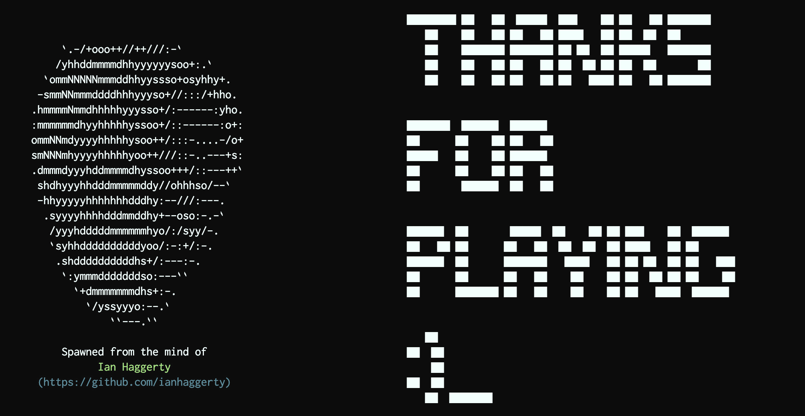

[](https://wakatime.com/badge/github/ianhaggerty/robot-me-baby)

# robot-me-baby

**robot-me-baby** is little demo app designed to demonstrate the features and power of [ink](https://github.com/vadimdemedes/ink) - a react renderer for the CLI.


<<<<<<< HEAD

=======

>>>>>>> 4681e21464505ddb55ab2521b7cf5fb06339341d




## Usage

Download and install.

```shell
git clone https://github.com/ianhaggerty/robot-me-baby
cd robot-me-baby
npm install .
```

### Production

Compile and run.

```shell
npm run compile
npm run start
```

### Development

1. Spin up a babel command to watch the `src` directory for changes.

   ```shell
   npm run watch
   ```

2. In another CLI instance, use nodemon to watch the `lib` directory.

   ```shell
   npm run nodemon
   ```

## 🌎 Road Map

- [Routing Solution](https://reactrouter.com/web/api/MemoryRouter) React Router was built for the browser, but it has a `MemoryRouter` that can be used in different environments.
- **Pew Pew Lasers?** There is no absolute positioning as part of the Ink library. Splasers from one's eyeballs would be fun, but ni-un impossible to implement using flexbox.
- **Switch Focus on KeyPress** Imperatively changing focus using the `Ink` library is not possible (only `next` and `previous`). A [recent commit](https://github.com/vadimdemedes/ink/issues/426) has pushed this, so just waiting for release cycle.
- Redux (Little Boilerplate)

## Library Links

- [Ink](https://github.com/vadimdemedes/ink)
- [ink-gradient](https://github.com/sindresorhus/ink-gradient)
- [ink-link](https://github.com/sindresorhus/ink-link)
- [ink-big-text](https://github.com/sindresorhus/ink-big-text)
- [ASCII Robots](https://www.asciiart.eu/electronics/robots)
- [ASCII Explosions](https://www.asciiart.eu/weapons/explosives)
- [ASCII Text Generation](http://patorjk.com/software/taag/#p=testall&h=3&v=3&f=Blocks&t=ian)
- [Robot Voices](https://www.mediamusicnow.co.uk/royalty-free-sound-effects/robot-voices)
- [Robot Sound Effects](https://mixkit.co/free-sound-effects/robot/)
- [unique-names-generator](https://www.npmjs.com/package/unique-names-generator)
- [console-clear](https://www.npmjs.com/package/console-clear)
- [emoji bank](http://xahlee.info/comp/unicode_emoticons.html)
- [Blackhole - virtual audio driver](https://github.com/ExistentialAudio/BlackHole)

## Learning Links

This is a bunch of stuff I stumbled across whilst developing. Largely kept here for my own benefit.

- [nodemon: Option to allow stdin to be inherited](https://github.com/remy/nodemon/issues/1036) Nodemon hijacks the stdin readstream and does unwanted things. This can make it difficult to develop CLI with an auto refresh... Hot reload would be 10x better. I quickly rolled my own solution in this repo.
- [node: reading keystrokes](https://stackoverflow.com/questions/5006821/nodejs-how-to-read-keystrokes-from-stdin) See answer from Dan Heberden. Raw Mode basically means, feed me what the user types - nothing else! (Including ctrl-c)
- [debug typescript with jest](https://medium.com/@mtiller/debugging-with-typescript-jest-ts-jest-and-visual-studio-code-ef9ca8644132)
  This gets the job done.
- [mapping an empty array](https://itnext.io/heres-why-mapping-a-constructed-array-doesn-t-work-in-javascript-f1195138615a) Basically you can't call `.map` on an uninitialized array as the pointers don't point to anything yet. Therefore, the implementation considers there to be nothing to _map_ over.
- [Array.prototype.map weirdness](https://stackoverflow.com/questions/5501581/javascript-new-arrayn-and-array-prototype-map-weirdness)
  `array.map` doesn't work on array's created with `new Array(size)`.
- [muted color palette](https://id.pinterest.com/pin/761389880740038172/)
  Muted Colors for the robots!
- [string.replace](https://developer.mozilla.org/en-US/docs/Web/JavaScript/Reference/Global_Objects/String/replace#specifying_a_function_as_a_parameter) You can pass a function instead of a string - useful when matching regExp patterns.
- [setTimeout & react state](https://upmostly.com/tutorials/settimeout-in-react-components-using-hooks) Ordinarily, setTimeout takes a function - and that function captures the enclosing scope. Within that scope may be variables populated by state hooks. Therefore, state from accessed within setTimeout isn't necessarily up to date. **In hindsight, it's better to `useEffect` and respond to state changes as necessary**. _see below_
- [TS getters and setters](https://www.typescripttutorial.net/typescript-tutorial/typescript-getters-setters/#:~:text=Introduction%20to%20TypeScript%20Getters%20and%20Setters&text=The%20getters%20and%20setters%20allow,the%20properties%20of%20a%20class.&text=A%20getter%20method%20returns%20the,method%20updates%20the%20property's%20value.) I'm a big fan of getters / setters in TS. However, they must be used carefully in React. If you're wrapping data with classes (like I do here), you need to **make sure your classes are immutable** - well, at least if you intend to use them as React State within a component. The react diff algorithm only does shallow test (test by reference or value for a primitive).
- [Cleaning up Timers using Hooks](https://stackoverflow.com/questions/53464595/how-to-use-componentwillmount-in-react-hooks) This is critical knowledge for a React developer!
- [Understanding esModuleInterop in tsconfig file](https://stackoverflow.com/questions/56238356/understanding-esmoduleinterop-in-tsconfig-file)
- [When to use JSX.Element vs ReactNode vs ReactElement?](https://stackoverflow.com/questions/58123398/when-to-use-jsx-element-vs-reactnode-vs-reactelement)

## Thank You

To the awesome people behind [Ink](https://github.com/vadimdemedes/ink), the React-Renderer used extensively in this project.

\+ The Gazzillion other people whose work I've sponged and reincarnated as my own. Projects like this have a heap of dependencies.

## MIT License

Copyright (c) 2021 Ian Haggerty

Permission is hereby granted, free of charge, to any person obtaining a copy
of this software and associated documentation files (the "Software"), to deal
in the Software without restriction, including without limitation the rights
to use, copy, modify, merge, publish, distribute, sublicense, and/or sell
copies of the Software, and to permit persons to whom the Software is
furnished to do so, subject to the following conditions:

The above copyright notice and this permission notice shall be included in all
copies or substantial portions of the Software.

THE SOFTWARE IS PROVIDED "AS IS", WITHOUT WARRANTY OF ANY KIND, EXPRESS OR
IMPLIED, INCLUDING BUT NOT LIMITED TO THE WARRANTIES OF MERCHANTABILITY,
FITNESS FOR A PARTICULAR PURPOSE AND NONINFRINGEMENT. IN NO EVENT SHALL THE
AUTHORS OR COPYRIGHT HOLDERS BE LIABLE FOR ANY CLAIM, DAMAGES OR OTHER
LIABILITY, WHETHER IN AN ACTION OF CONTRACT, TORT OR OTHERWISE, ARISING FROM,
OUT OF OR IN CONNECTION WITH THE SOFTWARE OR THE USE OR OTHER DEALINGS IN THE
SOFTWARE.
